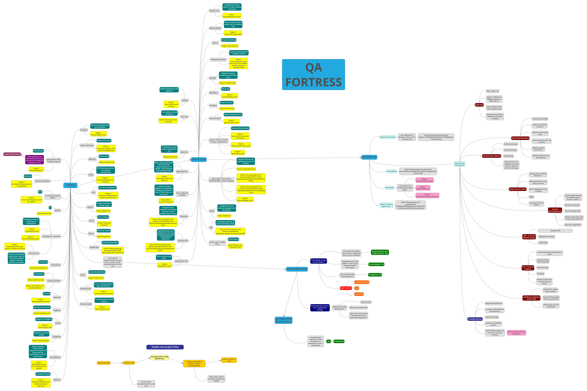

# qa-fortress

Idea of Quality Assurance Fortress is to set (potentially) automated, open-source type structure of testing tools covered with up to date documentation.

***Here are some links:***

* Initial papers - [doc file](https://docs.google.com/document/d/1xOxVAY6QLKMddnGBApYQdoiHpAf2g4mUwWk3Ibrwkpg/edit?usp=sharing)

* Types of testing approaches - [sheet file](https://docs.google.com/spreadsheets/d/1pBx5GVdU08WgqkFdxSwlHzpEs4Ok-rYyHtbq_byiQSk/edit?usp=sharing)

* Mindpmup original file (with links available) - [mindmup file](https://atlas.mindmup.com/degordianqa/qa_fortress/index.html)
*How to "mind map":*
Just double click on node to see more and vice versa to retract. :mag:

* Local documentation - [directory](https://github.com/degordian/qa-fortress/tree/master/localDocs)

***Please feel free to contribute!*** :blush: 
:point_right: [Contribute guidelines](https://github.com/degordian/qa-fortress/blob/master/docs/CONTRIBUTING.md)

***Mental map nodes explained:***
* 'Helpy stuff' - additional (mostly free) tools and accessories that can help you out in your testing environment (difference between them and "TOOLS" node is that "Helpy stuff" has more subjective usage than objective).

* 'Local documentation' - extract from official documentation on chosen tool; creating through this approach simple and additional usage files for easier ongoing use of chosen tool.

* 'Support HQ' - "branches" that go beyond QA fields, but from where the trunk stands. :palm_tree:

### TODO

- [ ] Arrange project inside robust test management tool or on presentation website with advanced search, or...
- [ ] Create/ extract 'local' documentation - :construction: work in progress :construction:
- [x] Update mind map png file on [MindMup](https://www.mindmup.com/)
- [x] Add security, blockchain and testing approach components to mind map
